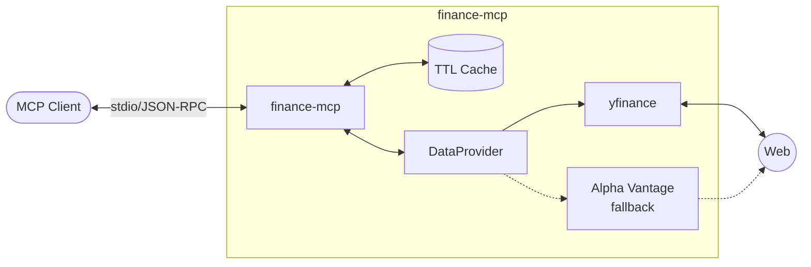

# Finance MCP

[](https://github.com/yurykudrovsky/finance-mcp/actions/workflows/ci.yml)
[](#)
[](https://www.python.org/downloads/release/python-3120/)
[](https://opensource.org/licenses/MIT)

A production-grade **Model Context Protocol (MCP)** server that turns Claude Desktop into a quantitative financial analyst. Exposes real-time stock quotes, historical OHLCV, technical indicators, and news natively to LLMs.


Built with Python 3.12, the official `mcp[cli]` SDK, and `yfinance`.

> **API keys:** `yfinance` is the primary source and requires no key. An optional `ALPHA_VANTAGE_API_KEY` env var enables a fallback when yfinance fails. Without it, the server runs on yfinance only — see `.env.example`.

## Example Queries

Ask Claude these once the server is configured:

1. **"What's the current price and volume for AAPL?"** → `get_quote`
2. **"Compare fundamentals of AAPL vs MSFT."** → `compare_stocks`
3. **"Show me the RSI for TSLA."** → `calc_indicators`
4. **"1-month OHLCV history for NVDA, daily interval."** → `get_history`
5. **"P/E ratio and market cap for GOOGL?"** → `get_fundamentals`
6. **"Latest news on NVDA."** → `get_news`

## Tools

- **`get_quote(symbol)`** — Current price, % change, volume. Cached 60 s.
- **`get_history(symbol, period, interval)`** — Historical OHLCV data.
- **`get_fundamentals(symbol)`** — P/E ratio, market cap, dividend yield, sector. Cached 1 h.
- **`compare_stocks(symbols)`** — Side-by-side metrics for multiple symbols.
- **`calc_indicators(symbol, indicator)`** — RSI, MACD, SMA20/50/200.
- **`get_news(symbol, limit=5)`** — Recent headlines, URLs, timestamps. Cached 15 min.

## Architecture



## Installation

1. Install [`uv`](https://docs.astral.sh/uv/) if you haven't already.
2. Clone and sync:

```bash
git clone https://github.com/yurykudrovsky/finance-mcp.git
cd finance-mcp
uv sync
```

## Claude Desktop Configuration

Add to your `claude_desktop_config.json`:

```json
{
  "mcpServers": {
    "finance": {
      "command": "/absolute/path/to/uv",
      "args": [
        "run",
        "--directory",
        "/absolute/path/to/finance-mcp",
        "finance-mcp"
      ]
    }
  }
}
```

> **⚠️ macOS PATH gotcha:** The Claude Desktop GUI does not inherit your shell's `PATH`. If you just use `"command": "uv"`, it will likely fail silently. Find your absolute `uv` path by running `which uv` (e.g. `/usr/local/bin/uv` or `/opt/homebrew/bin/uv`) and use that instead.
> 
> Also make sure to replace `/absolute/path/to/finance-mcp` with the actual path on your machine.

## Development

```bash
uv sync --dev          # install dev deps
uv run pytest tests/   # run tests
uv run ruff check src/ tests/           # lint
uv run mypy --strict src/ tests/        # type check
```
