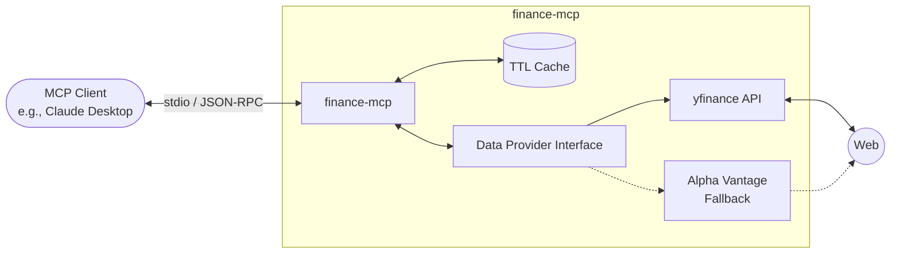

# Finance MCP

[](https://github.com/yurykudrovsky/finance-mcp/actions/workflows/ci.yml)
[](#)
[](https://www.python.org/downloads/release/python-3120/)
[](https://opensource.org/licenses/MIT)

A production-grade **Model Context Protocol (MCP)** server that turns Claude Desktop into a quantitative financial analyst. Seamlessly exposes real-time stock market data, historical OHLCV, and technical indicators natively to LLMs. 

Built using Python 3.12, the official `mcp[cli]` SDK, and `yfinance`. **No API key is required!**

 *(Generated using `vhs docs/demo.tape`)*

## Architecture



## Example Queries

Try asking Claude these natural-language prompts once the server is configured:

1. **"What is the current stock price and trading volume for AAPL?"** *(Uses `get_quote`)*
2. **"Compare the fundamentals of AAPL vs MSFT."** *(Uses `compare_stocks`)*
3. **"Show me the RSI for TSLA."** *(Uses `calc_indicators`)*
4. **"Can you pull the 1-month historical OHLCV data for NVDA with a 1-day interval?"** *(Uses `get_history`)*
5. **"What is the P/E ratio and market cap for GOOGL?"** *(Uses `get_fundamentals`)*
6. **"What's the latest news on NVDA?"** *(Uses `get_news`)*


## What It Is

Finance MCP allows any AI assistant that supports the Model Context Protocol to seamlessly retrieve real-time and historical stock market data, calculate technical indicators, and compare multiple assets. It uses a robust, asynchronous architecture with Pydantic for data validation and built-in TTL caching to optimize network requests.

## Tools Available

| Tool | Description | Cache TTL |
|------|-------------|-----------|
| `get_quote(symbol)` | Current price, % change, and trading volume | 60 s |
| `get_history(symbol, period, interval)` | Historical OHLCV data | — |
| `get_fundamentals(symbol)` | P/E ratio, market cap, dividend yield, sector | 1 h |
| `compare_stocks(symbols)` | Side-by-side metrics for multiple symbols | — |
| `calc_indicators(symbol, indicator)` | RSI, MACD, SMA20/50/200 | — |
| `get_news(symbol, limit=5)` | Recent news headlines, URLs, and timestamps | 15 min |

## Installation

1. Ensure you have `uv` installed.
2. Clone this repository and sync the dependencies:

```bash
git clone https://github.com/yurykudrovsky/finance-mcp.git
cd finance-mcp
uv sync
```

## Claude Desktop Configuration

To use this server with Claude Desktop, add the following configuration to your `claude_desktop_config.json`:

```json
{
  "mcpServers": {
    "finance": {
      "command": "uv",
      "args": [
        "run",
        "--directory",
        "/absolute/path/to/finance-mcp",
        "finance-mcp"
      ]
    }
  }
}
```

*Make sure to replace `/absolute/path/to/finance-mcp` with the actual path on your machine.*

## Development Setup

The project uses `uv` for environment management, `pytest` for testing, `ruff` for linting, and `mypy` for type-checking.

1. Install dev dependencies:
   ```bash
   uv sync --dev
   ```

2. Run tests:
   ```bash
   uv run pytest tests/
   ```

3. Run linting & type-checking:
   ```bash
   uv run ruff check src/ tests/
   uv run mypy --strict src/ tests/
   ```
