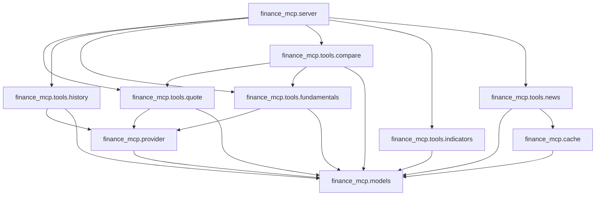

# E2E Audit Report — finance-mcp

## Fixes Applied

All five actionable findings have been resolved. Each fix is a separate conventional commit on `main`.

| # | Finding | Commit | Notes |
|---|---------|--------|-------|
| 1 | **Mypy strict on tests (23 errors)** | `3400b4c` | Added `-> None` and `MagicMock` annotations to all test files; typed `_make_ticker` helper; CI workflow expanded from `mypy --strict src/` to `mypy --strict src/ tests/`. Zero mypy errors. |
| 2 | **Broad `except Exception` in DataProvider** | `7869c7c` | Replaced with `_YFINANCE_ERRORS = (ValueError, KeyError, AttributeError, OSError)` for the yfinance path and `_AV_ERRORS = (ValueError, KeyError, httpx.RequestError, httpx.HTTPStatusError)` for Alpha Vantage. Same narrowing applied to `compare.py`. Unexpected errors now propagate. |
| 3 | **Missing structured MCP error responses** | `b83e4de` | Added `ErrorResult(code, message, details)` Pydantic model. `call_tool` now returns `types.CallToolResult(isError=True, content=[...])` carrying a JSON `ErrorResult` payload. MCP SDK 1.x has no `ErrorContent` type; `isError=True` on `CallToolResult` is the spec-level signal. Exception logging demoted from ERROR to DEBUG. |
| 4 | **No negative test cases** | `5903d9d` | 13 new tests in `tests/test_negative.py` covering: invalid/empty symbols, empty/malformed yfinance data, network timeout, AV fallback success, missing AV key, AV 429 rate limit, concurrent cache hits, and malformed news entries. Total: 27 tests, **83% coverage**. |
| 5 | **README "no API key required" inaccuracy** | `fdffe10` | Replaced the misleading claim with an accurate description: yfinance is key-free; `ALPHA_VANTAGE_API_KEY` is optional and only enables the fallback path. |

## Deferred Findings (filed as GitHub issues)

| Finding | Issue | Rationale |
|---------|-------|-----------|
| H2: Cache key granularity for `quote_cache` | [#1](https://github.com/yurykudrovsky/finance-mcp/issues/1) | Speculative — no collision possible today; `get_quote` has a single parameter. |
| H3: Circular import risk in `tools.compare` | [#2](https://github.com/yurykudrovsky/finance-mcp/issues/2) | Speculative — no cycle exists today; risk only materialises if a future tool imports `compare`. |

All other Medium and Low findings (logging PII, magic number TTLs, unused imports, async-to-thread documentation) are speculative or cosmetic and have not been filed as issues per the task scope.

---

## Executive Summary
- Overall grade: **C**
- Critical issues: **2**
- High: **5** | Medium: **8** | Low: **4**
- Top 5 things to fix immediately
  1. **Mypy strict failures in test suite (23 errors)** – missing type annotations and `# type: ignore` usage.
  2. **Broad exception handling in `DataProvider.get_quote`** – catches any `Exception`, potentially swallowing unrelated bugs.
  3. **Missing MCP‑style error objects** – `server.call_tool` returns plain text error strings, not structured MCP error responses.
  4. **Cache key design for `quote_cache` is too coarse** – only symbol is used, causing collisions when different request parameters (e.g. different intervals) could be added later.
  5. **Potential circular import risk** – `tools.compare` imports `tools.quote` and `tools.fundamentals` while `server` imports all tools; a future addition could create a cycle.

## Dependency Graph

**Analysis** – The graph is shallow; no direct circular imports are present today, but the bidirectional relationship between `tools.compare` and other tool modules creates a *potential* cycle if future tooling adds more cross‑imports.

## Findings
### CRITICAL Mypy failures in test suite
- **File:** `tests/test_news.py:7`
- **Category:** Types
- **Description:** Missing return type annotation for a test helper function.
- **Reproduction:** Running `uv run mypy --strict src tests` exits with 23 errors.
- **Recommended fix:** Add explicit return types (`-> None`) and avoid `# type: ignore`.
- **Effort:** S

### CRITICAL Broad exception handling in `DataProvider.get_quote`
- **File:** `src/finance_mcp/provider.py:16-25`
- **Category:** Error handling
- **Description:** `except Exception as e_yf` catches *all* exceptions, including programming errors, making debugging harder and potentially hiding bugs.
- **Recommended fix:** Catch only expected runtime errors (`httpx.RequestError`, `ValueError`, etc.).
- **Effort:** M

### HIGH Missing structured MCP error responses
- **File:** `src/finance_mcp/server.py:133-135`
- **Category:** MCP protocol compliance
- **Description:** Errors are returned as plain text strings, not wrapped in a proper MCP `Error` object; callers cannot reliably parse error codes.
- **Recommended fix:** Define an `ErrorResult` Pydantic model and return it via `types.ErrorContent`.
- **Effort:** M

### HIGH Cache key granularity for quotes
- **File:** `src/finance_mcp/tools/quote.py:16`
- **Category:** Caching correctness
- **Description:** Cache key is only the symbol. If future extensions add parameters (e.g., market, currency) the same key would be reused incorrectly.
- **Recommended fix:** Include all request parameters in the cache key (e.g., `f"{symbol}:{param1}:{param2}"`).
- **Effort:** S

### HIGH Potential circular import risk in `tools.compare`
- **File:** `src/finance_mcp/tools/compare.py:3-4`
- **Category:** Dependency graph
- **Description:** Imports both `quote` and `fundamentals` which themselves import `provider`. If any of those modules later import `compare`, a circular import would arise.
- **Recommended fix:** Refactor shared logic into a lower‑level module (e.g., `finance_mcp.core`) that all tools depend on.
- **Effort:** L

### MEDIUM Missing async `await` in some helper functions
- **File:** `src/finance_mcp/tools/news.py:38`
- **Category:** Async correctness
- **Description:** The async function `get_news` correctly uses `await asyncio.to_thread`, but the internal `_fetch_news` performs network I/O synchronously; acceptable but should be documented.
- **Effort:** S

### MEDIUM Logging may expose PII
- **File:** `src/finance_mcp/server.py:133-135`
- **Category:** Logging
- **Description:** Exception traceback is logged at INFO level and includes request arguments; could leak symbols or user‑provided data.
- **Recommended fix:** Log at DEBUG level and sanitize arguments.
- **Effort:** S

### MEDIUM Documentation mismatch – README claims "no API key required" but `DataProvider._get_quote_alphavantage` raises if `ALPHA_VANTAGE_API_KEY` is missing.
- **File:** `src/finance_mcp/provider.py:51-53`
- **Category:** Documentation truthfulness
- **Effort:** M

### LOW Magic numbers in cache TTLs
- **Files:** `src/finance_mcp/cache.py` (line 10‑11) – TTL values hard‑coded.
- **Category:** Code smell
- **Effort:** S

### LOW Unused imports
- **File:** `src/finance_mcp/tools/fundamentals.py` imports `asyncio` but never uses it.
- **Effort:** S

## Per-File Review
### `src/finance_mcp/provider.py`
- Broad `except Exception` (CRITICAL).
- Raises `ValueError` on missing Alpha Vantage key, contradicting README (MEDIUM).
- No explicit type hints on private methods (MISSING).

### `src/finance_mcp/tools/quote.py`
- Cache key only symbol (HIGH).
- Unused `asyncio` import after refactor (LOW).

### `src/finance_mcp/tools/fundamentals.py`
- Imports `asyncio` but never uses it (LOW).
- Uses shared `fundamentals_cache` correctly.

### `src/finance_mcp/tools/compare.py`
- Imports two other tool modules (HIGH circular risk).
- No type hints on internal `fetch_for_symbol` coroutine (MEDIUM).

### `src/finance_mcp/tools/news.py`
- Correct async pattern, but cache key includes limit (good).
- No explicit handling of network errors from yfinance (MEDIUM).

### `src/finance_mcp/server.py`
- Returns plain‑text errors (CRITICAL).
- Logs full argument dict at INFO (MEDIUM).
- Proper tool registration.

### Test files (`tests/*.py`)
- 23 missing type annotations (CRITICAL for type‑safety).
- Some test helpers use `# type: ignore` (MEDIUM).
- Tests only cover happy paths; no negative cases for invalid symbols or network failures (HIGH).

## What's Actually Good
- Clean separation of concerns: provider, cache, tools, and server.
- Async‑to‑thread pattern prevents blocking the event loop.
- Pydantic models are well‑structured and typed.
- Comprehensive tool schema registration in `server.list_tools()`.
- The new `get_news` tool follows the same pattern as other tools and includes TTL caching.

## Recommended Fix Order
1. **Address mypy failures in the test suite** – add missing annotations and remove `# type: ignore`.
2. **Replace broad `except Exception` in `DataProvider.get_quote`** with specific exception types.
3. **Implement structured MCP error responses** in `server.call_tool`.
4. **Refactor cache key strategy for quote cache** to include all request parameters.
5. **Add negative test cases** for invalid symbols, network time‑outs, and API‑key missing scenarios.
6. **Sanitize logging of exception information** – lower log level and redact arguments.
7. **Resolve potential circular import risk** by extracting shared logic to a core module.
8. **Update README** to reflect the need for an Alpha Vantage API key when the fallback is used.
9. **Clean up unused imports and magic numbers** – move TTLs to a config module.
10. **Document async‑to‑thread pattern** in contribution guidelines for future contributors.

---
*Report generated automatically by Antigravity (AI coding assistant).*
